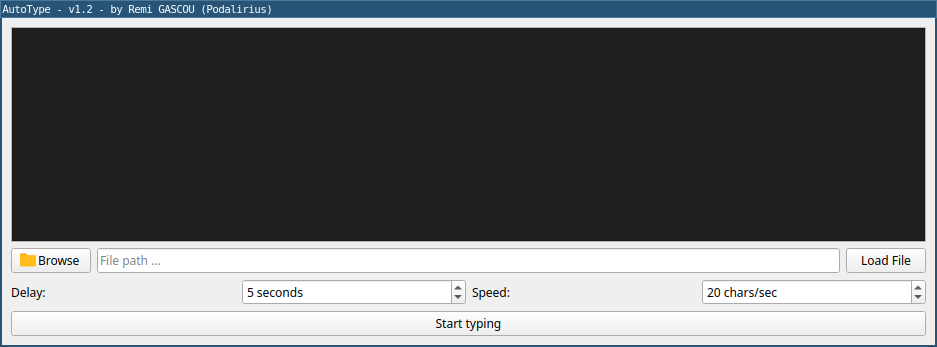

<p align="center">
    A Python tool to simulate keyboard typing when copy-paste functionality is unavailable, with both CLI and GUI modes.
    <br>
    
    <a href="https://twitter.com/intent/follow?screen_name=podalirius_" title="Follow"></a>
    <a href="https://www.youtube.com/c/Podalirius_?sub_confirmation=1" title="Subscribe"></a>
    <br>
</p>

## Features

- [x] Read text from a file or stdin in CLI mode
- [x] Read text from a text box or from a file in GUI mode
- [x] Customizable delay between each character
- [x] Customizable delay before starting
- [x] Prevents mental breakdowns when you have to retype things because of lack of copy-paste functionality

## Overview

AutoType is a multi-purpose tool designed to simulate keyboard typing when traditional copy-paste functionality is unavailable or restricted.

It's particularly useful in environments like Citrix, Apache Guacamole, VNC, or RDP sessions where clipboard access is limited or disabled. Instead of manually typing long sequences of text, commands, or code, AutoType can automatically type the content for you with customizable timing and delays.

This makes it invaluable for system administrators, developers, and IT professionals who are on the verge of a mental breakdown having to retype things because of lack of copy-paste functionality.

The tool provides both a command-line interface and a user-friendly GUI, allowing you to easily input text across system boundaries while maintaining precise control over the typing speed and timing.

## First run

First, you need to install the requirements:

```bash
$ pip install -r requirements.txt
```

Then, you can run the tool:

```bash
$ ./autotype.py --gui
```

## Usage

```
$ ./autotype.py -h
usage: autotype.py [-h] (--stdin | --file INPUT_FILE | --gui) [--delay DELAY] [--interval INTERVAL]

AutoType, a Python tool to simulate keyboard typing when copy-paste functionality is unavailable, with both CLI and GUI modes.

options:
  -h, --help           show this help message and exit
  --stdin              Read input from stdin.
  --file INPUT_FILE    Read input from a file.
  --gui                Start GUI mode.

Options:
  --delay DELAY        Delay before starting to type in seconds.
  --interval INTERVAL  Interval between each character in milliseconds.
```

## Demonstration

The graphical interface provides an intuitive way to load text from files or type directly in the text box, with configurable delay and typing speed settings:



## Contributing

Pull requests are welcome. Feel free to open an issue if you want to add other features.
